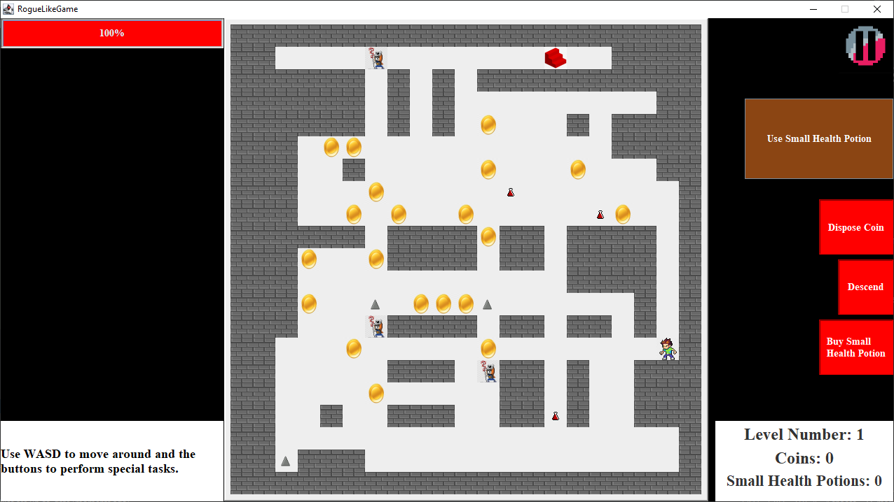

# ***Deep Dungeon - a roguelike dungeon crawler***

Deep Dungeon is a Java-based desktop application that uses a Java Swing-based GUI. 
The project encompasses 29 distinct user stories and has been tested with 171 unit tests written in JUnit over 6 stages of development. 
The game offers an exciting challenge with 3 levels that feature randomly generated maps, and utilizes the A\* search algorithm for the enemy AI.

## *Inspiration*

I have prior experience with playing various rogue-like dungeon games such as 
- Hades (2018), 
- The Enchanted Cave 2 (2015), and 
- Pokemon Mystery Dungeon: Blue Rescue Team (2005). 

I have always been curious about the development of these games. This project gave me the opportunity to indulge that curiosity. Additionally, this project has given me the opportunity to practice Test Driven Development (TDD), writing cohesive and decoupled code, and implementing a Single Point of Control to aid in game design.

## *Game Specification*
### *Map*
The game generates a *map* with walls, a single entry point, a single exit point, spikes, enemies,
small health potions, and coins.

### *Enemies*

The enemies follow you around regardless of how many there are.

### *Random Map Generation*

The level changes each time you descend through the stairs.

 
### *Objective*
The objective of the game is for the player to navigate through various levels, starting from the entry point and avoid obstacles like spikes and enemies, in order to reach the exit point and move to the next level. The game is over once the player completes all three levels.

### *Mechanics*
- The player starts with a single life.
- When the player's health bar reaches zero, the player loses the game.
- The player has a wallet to store coins.
- The player can collect coins by walking on coin tiles.
- The player loses 25 health upon walking into an enemy.
- The player loses 100 health upon walking into a spike.
- The player can pick up small health potions.
- The player can purchase a small health potion for 10 coins.
- Using a small health potion will restore 25 health points.
- The player can discard coins.
- The player can move around the map using the WASD keys.

## *User Stories*
### Phase 1
In phase 1, the following user stories were implemented:

- As a user, I want to be able to navigate a room using WASD. (Completed)
- As a user, I want to be able to interact with the exit point to complete the level. (Completed)
- As a user, I want to be able to die (lose all health) if I walk into a spike. (Completed)
- As a user, I want to be able to add coins to my wallet as a count of my score. (Completed)

### Phase 2
In phase 2, the following user stories were implemented:

- As a user, I want to be able to access a menu on starting the application. (Completed)
- As a user, I want to be able to start a new game or load a saved game from a save file. (Completed)
- As a user, I want to be able to save the current game to a save file. (Completed)
- As a user, I want to have access to at least 3 save files. (Completed)

### Post Phase 2
After phase 2, the following user stories were implemented:

- As a user, I want to be able to see an enemy on the map. (Completed)
- As a user, I want to be able to pause the game and access a menu with options to return to the game, return to the main menu without saving, save the game, and exit the game. (Completed)
- As a user, I want to be able to see my current health. (Completed)
- As a user, I want to be able to lose 20 health upon walking into an enemy and not be able to walk through them. (Completed)
- As a user, I want to be able to add Small Health Potions to my inventory. (Completed)
- As a user, I want to be able to use Small Health Potions in my inventory to increase my health by 25. (Completed)

### Phase 3
In phase 3, the following user stories were implemented:

#### GUI Implementation:
- As a user, I want to be able to see a panel where all the Coins that have been added to the Player's Wallet are displayed. (Completed)
- As a user, I want to be able to click a button to reduce 10 coins (Xs) in my wallet (Y) and buy a Small Health Potion. (Completed)
- As a user, I want to be able to click a button to dispose a coin, i.e., drop one coin (X) from my wallet (Y). (Completed)
- As a user, I want to be able to click on a Use Small Health Potion Button to use a SmallHealthPotion and add health to my HealthBar. (Completed)
- As a user, I want to be able to click on a Descend Button to make the Player interact with the ExitPoint to complete a level. (Completed)
- As a user, I want to be able to access menus with menu items that allow me to load and save the game. (Completed)
- As a user, I want to be able to hear a sound when I die or complete the game. (Completed)

### Post Phase 3
After phase 3, the following user story was implemented:
- As a user, I want to be able to see graphical images to represent the game sprites. (Completed)

### Phase 4
This phase involved increasing code robustness and refactoring to implement design patterns.

#### Phase 4: Task 2
I chose to implement a robust class named Inventory in my model package. It contains three methods that are tested for a checked exception, both when the exception is thrown and not thrown.

Class Name: Inventory
Method Names: addSmallHealthPotions(), addOneSmallHealthPotion(), addOneSmallHealthPotion()

#### Phase 4: Task 3
This is a discussion of future refactoring possibilities.

I would refactor the MainMenu, LoadGame, SaveGame, and PauseMenu classes so that they all extend an abstract menu class that implements the ActionListener interface. I would then override the actionPerformed() method belonging to that interface so that these subclasses would only have the required additional functionality, and a large portion of repetitive code would be removed consequently.
In future improvements of this project, I hope to use a pathfinding algorithm to allow enemies to follow the player, and a procedural generation algorithm for the level so that it has high replayability.

### Phase 5
The following user stories were implemented in phase 5:

#### Pathfinding Implementation
- As a user, I want to have an enemy follow me around as I move. (Completed)
- As a user, I want to have multiple enemies follow me around as I move. (Completed)
- As a user, I want to be able to be trapped by enemies so that I'm forced to either quit or die to lose the game. (Completed)

### Phase 6
The following user stories were implemented in phase 6:

#### Procedural Generation Implementation Using A Random Walker Algorithm
- As a user, I want to have the level change completely every time I create a new game. (Completed)
- As a user, I want to have the level change every time I descend through the stairs. (Completed)
- As a user, I want to be able to descend through 3 dungeon levels before descending again to finish the game. (Completed)

### Extras
- As a user, I want to be able to hear a sound every time I complete a level. (Completed)
